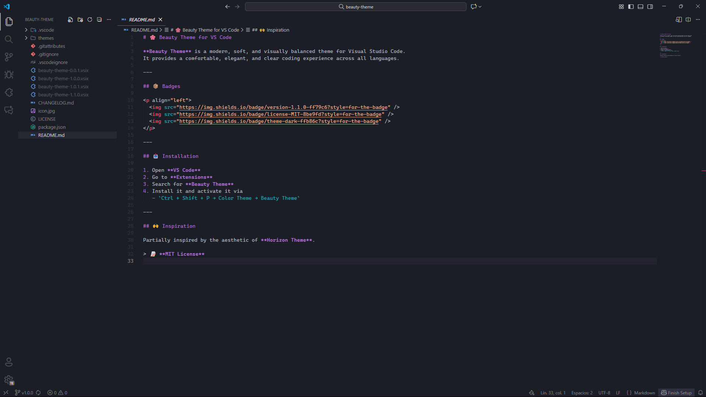

# 🌸 Beauty Theme for VS Code

**Beauty Theme** is a modern, soft, and visually balanced theme for Visual Studio Code.  
It provides a comfortable, elegant, and clear coding experience across all languages.

---

## 📦 Badges

  
  
  

---

## 📥 Installation

1. Open **VS Code**  
2. Go to **Extensions**  
3. Search for **Beauty Theme**  
4. Install it and activate it via  
   - `Ctrl + Shift + P → Color Theme → Beauty Theme`

---

## 🙌 Inspiration

Partially inspired by the aesthetic of **Horizon Theme**.

> 📝 **MIT License**
